​	

## Table of Contents

* Data Interpretation
* Tools
* Algorithm
* Summary

## Data Interpretation

The data contains 60 features, in which the target field is the prediction target. The main feature fields are divided into two categories: cat and num, which are discrete features and numerical features, respectively.

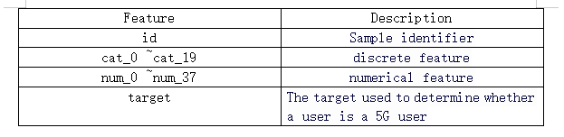

## Tools

Anaconda Navigator and Jupyter Notebook.

## Algorithm

### 1、LogisticRegression

#### （1）Packages and libraries

+ This is a data preprocessing library that is extremely important to the entire analysis process

  ```python
  #过采样-->训练模型
  !pip install imbalanced-learn==0.9.1  
  from imblearn.over_sampling import SMOTE
  ```

+ Other necessary libraries

```python
#导入所需的包
import pandas as pd
import numpy as np
import matplotlib.pyplot as plt

from sklearn.linear_model import LogisticRegression as LR
from sklearn.model_selection import train_test_split
from sklearn.metrics import confusion_matrix,classification_report
from sklearn.metrics import roc_auc_score,roc_curve,auc
```

#### (2)Get data and Analyze dataset

+ In this step, we need to check the basic information of the data and see if there are any duplicate values in the data.

```python
#导入原始数据集
df=pd.read_csv('./train.csv')
df.head()
#查看数据基本信息
df.info()
#查看数据是否有重复值
df.duplicated().sum()
#查看用户ID是否有重复值
len(np.unique(df['id']))==df.shape[0]
```

#### (3)Explore the distribution of features

+ In this step, we can see that the negative samples in the dataset are far more than the positive samples.

```python
df.describe()
df['target'].value_counts()
df['target'].value_counts().plot(kind='pie',autopct='%.3f%%')
```

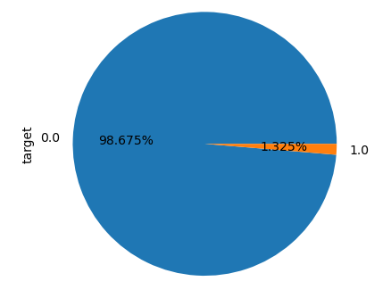

#### (4)Data preprocessing and preliminary modeling

+ Instantiate the logistic regression model, change the number of iterations until no warning of insufficient recursion is issued, and obtain the preliminary model. Observe the model output report and find that the high accuracy of the model is due to the high proportion of TN values predicted by the model.

```python
#切分训练集和测试集,并且进行随机数打乱
Xtrain,Xtest,Ytrain,Ytest=train_test_split(x,y,test_size=0.3,random_state=12)
#重置训练集和测试集的索引
for i in [Xtrain,Xtest,Ytrain,Ytest]:
    i.reset_index(drop=True,inplace=True)
clf=LR(max_iter=5000)
clf=clf.fit(Xtrain,Ytrain)
#查看测试集上auc面积
area=roc_auc_score(Ytest,clf.predict_proba(Xtest)[:,1])
area
print(classification_report(Ytrain,clf.predict(Xtrain)))
#可以看出少数类完全没有预测到，是由于非5G用户过多导致
#由此可以看出此时的模型是完全无效的
```

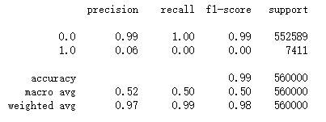

#### (5)normalization processing

+ Then, the MinMaxScaler function was used to normalize the continuous features in the dataset, and it was found that the auc area increased significantly after normalization. However, the TN value in the model had not yet been processed.

  ```python
  from sklearn.preprocessing import MinMaxScaler
  from sklearn.model_selection import cross_val_score
  #对模型进行归一化处理
  mms=MinMaxScaler()
  mms=mms.fit(Xtrain.iloc[:,20:])
  Xtrain_mms=pd.DataFrame(mms.transform(Xtrain.iloc[:,20:]),columns=Xtrain.columns[20:])
  Xtrain=pd.concat([Xtrain.iloc[:,0:20],Xtrain_mms],axis=1)
  Xtrain.head()
  Xtest_mms=pd.DataFrame(mms.transform(Xtest.iloc[:,20:]),columns=Xtest.columns[20:])
  Xtest=pd.concat([Xtest.iloc[:,0:20],Xtest_mms],axis=1)
  Xtest.head()
  #查看测试集上auc面积
  area=roc_auc_score(Ytest,clf1.predict_proba(Xtest)[:,1])
  area
  ```

#### (6)Change the sample weight

+ Next, we tried to start with changing the sample weights. First, we used the balanced sample parameters that came with the logistic regression model for balanced processing. After processing, the training auc area also slightly improved. Then we adopted another sample weight processing method--oversampling. After training with the results of oversampling, the auc area significantly improved, so we ultimately chose oversampling instead of balanced processing.

  ```python
  clf3=LR(max_iter=11000,C=9.4,class_weight="balanced")
  clf3=clf3.fit(Xtrain,Ytrain)
  from imblearn.over_sampling import SMOTE
  from collections import Counter
  model_smote = SMOTE()
  X_resampled, y_resampled = model_smote.fit_resample(Xtrain, Ytrain)
  print(Counter(y_resampled))
  X_test_resampled, y_test_resampled = model_smote.fit_resample(Xtest, Ytest)
  print(Counter(y_test_resampled))
  clf4=LR(max_iter=10000,C=9.4)
  clf4=clf4.fit(X_resampled, y_resampled)
  #查看测试集上auc面积
  area=roc_auc_score(Ytest,clf3.predict_proba(Xtest)[:,1])
  area
  #查看测试集上auc面积
  area=roc_auc_score(y_test_resampled,clf4.predict_proba(X_test_resampled)[:,1])
  area
  ```

  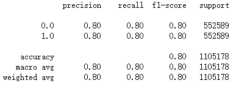

#### (7) Adjusting the hyperparameters and get the final model

+ Finally, the logistic regression model was optimized by adjusting the hyperparameters. Here, the cross-validation method was used to select the optimal value of the loss function parameter C. However, due to limitations of personal hardware facilities, the training time was too long and no results were obtained. Therefore, only manual cross-validation was implemented. Through experiments, the optimal value of C was determined to be 9.4, resulting in the final model. The Auc value was finally 0.8781833990349971. Observing the model output report, various indicators were also balanced. Based on the results, the ROC curve was drawn.

  ```python
  s_mean=[]
  Crange= np.linspace(1,15,10)
  for i in Crange:
      clf=LR(C=i)
     s_mean.append(cross_val_score(clf,Xtrain,Ytrain,cv=5).mean())
  print(f"当C={Crange[s_mean.index(max(s_mean))]}时,准确率最高为{max(s_mean)}")
  plt.plot(Crange,s_mean,c="r")
  clf=LR(max_iter=11000,C=9.4)
  print(classification_report(Ytest,clf.predict(Xtest)))
  FPR,recall,thresholds = roc_curve(Ytest,clf.predict_proba(Xtest)[:,1])
  ```

  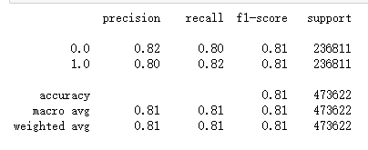

  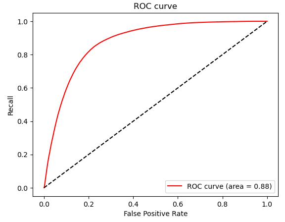

### 2、DecisionTreeClassifier🎄

#### (1)Packages and libraries

+ This is a data preprocessing library that is extremely important to the entire analysis process

  ```python
  #过采样-->训练模型
  !pip install imbalanced-learn==0.9.1  
  from imblearn.over_sampling import SMOTE
  ```

+ Other necessary libraries

  ```python
  import pandas as pd
  from sklearn import preprocessing
  from sklearn.model_selection import train_test_split
  from sklearn.tree import DecisionTreeClassifier,plot_tree
  ```

#### (2)Get data and process feature engineering 

+ ```python
  # 获取数据
  trainData=pd.read_csv("./train.csv")
  # 特征工程
  target=trainData['target']
  min_max_scaler =preprocessing.MinMaxScaler()
  numData=min_max_scaler.fit_transform(trainData[trainData.columns[21:59]])
  catData=trainData[trainData.columns[1:21]]
  df_num=pd.DataFrame(numData,columns=['num_'+str(i) for i in range(38)])
  feature=pd.concat([catData,df_num],axis=1)
  ```

+ Define the sample balance function: `sample_balance (X, y)`. X : feature variable; y : target variable; and the return value is the balanced x and y

  ```python
  def sample_balance(X, y):
      '''
      使用SMOTE方法对不均衡样本做过抽样处理
      :param X: 输入特征变量X
      :param y: 目标变量y
      :return: 均衡后的X和y
      '''
      model_smote = SMOTE()  # 建立SMOTE模型对象
      x_smote_resampled, y_smote_resampled = model_smote.fit_resample(X, y)  # 输入数据并作过抽样处理
      return x_smote_resampled, y_smote_resampled
  ```

+ Do sample balance : Execute `sample_balance()` to increase the number of negative samples so that the ratio of positive and negative samples in the original sample is equal.

  ```python
  feature, target = sample_balance(feature, target)
  ```

#### (3)Split the dataset and train the model

```python
X_train,X_test,y_train,y_test=train_test_split(feature,target,test_size=0.2,random_state=12)
model=DecisionTreeClassifier(max_depth = 10)
model.fit(X_train,y_train)
```

+ Output the roc_auc_score

  ```python
  from sklearn.metrics import roc_auc_score
  y_pred=model.predict_proba(X_test)[:,1]
  auc=roc_auc_score(y_test,y_pred)
  ```

  result：

  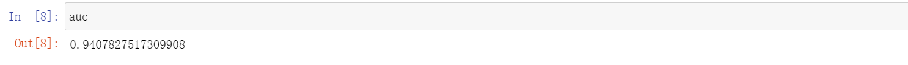

  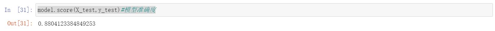

#### (4)Draw image

+ Draw the roc_auc_score curve

  ```python
  from sklearn.metrics import roc_curve
  import matplotlib.pyplot as plt
  from pylab import mpl
  fpr,tpr, thresholds = roc_curve(y_test,model.predict_proba(X_test)[:,1])
  mpl.rcParams['font.sans-serif'] = ['SimHei']
  plt.plot(fpr,tpr,label='ROC')
  plt.title('决策树模型的ROC曲线')
  plt.xlabel('FPR')
  plt.ylabel('TPR')
  plt.show()
  ```

  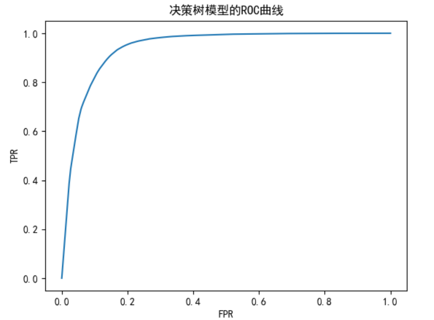	

  ​												-ROC curve for DecisionTree

+ Plot the structure of the decision tree (WARNIING：No Trypophobia!)

  ```python
  plt.figure(figsize=(20,20))
  plot_tree(model,filled=True)
  plt.show()
  plt.savefig('tree_visualization.png'
  ```

  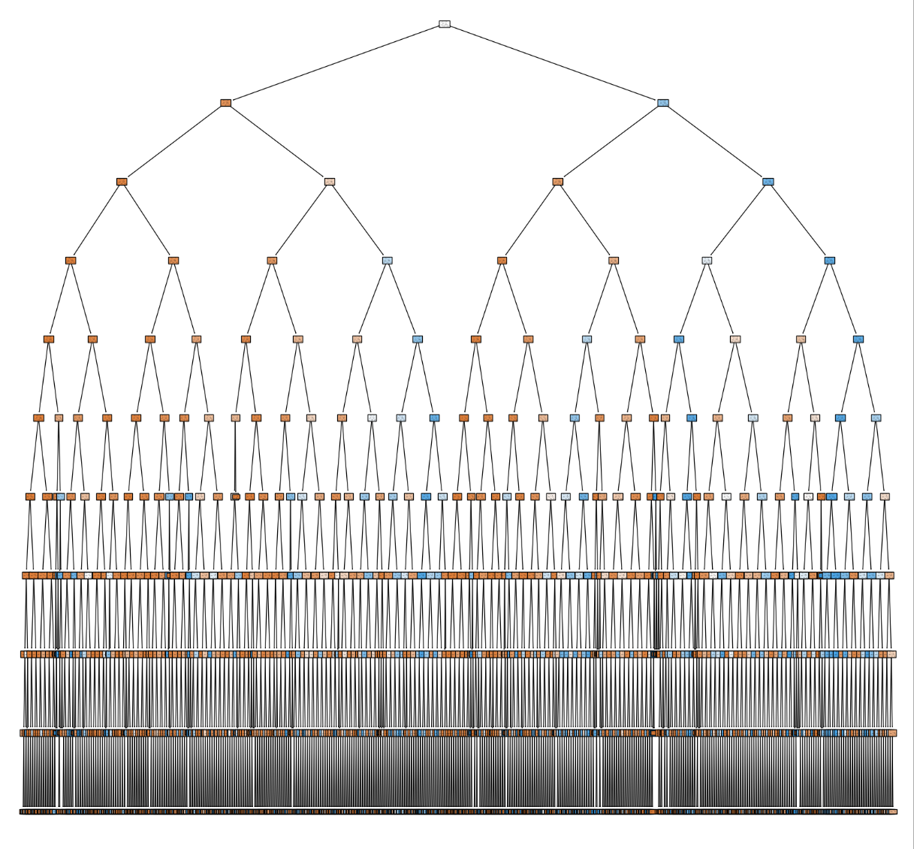

#### (5)optimization

+ If we change the `max_depth` of the tree to the default value, that is, let the traversal proceed to the end, we can see that the final auc score and the accuracy of the model will be improved, but the downside is that the generalization of the model will be reduced

  after optimization：

  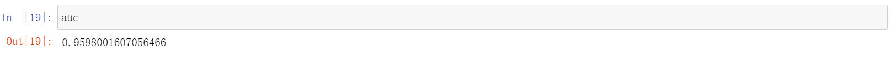

  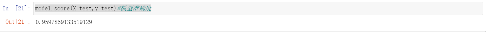

## Summary

+ Compared with LogisticRegression, the DecisionTreeClassifier has a relatively high score, which indicates that its ability to solve classification problems is better, but many factors still need to be considered when it is put into production

### 
